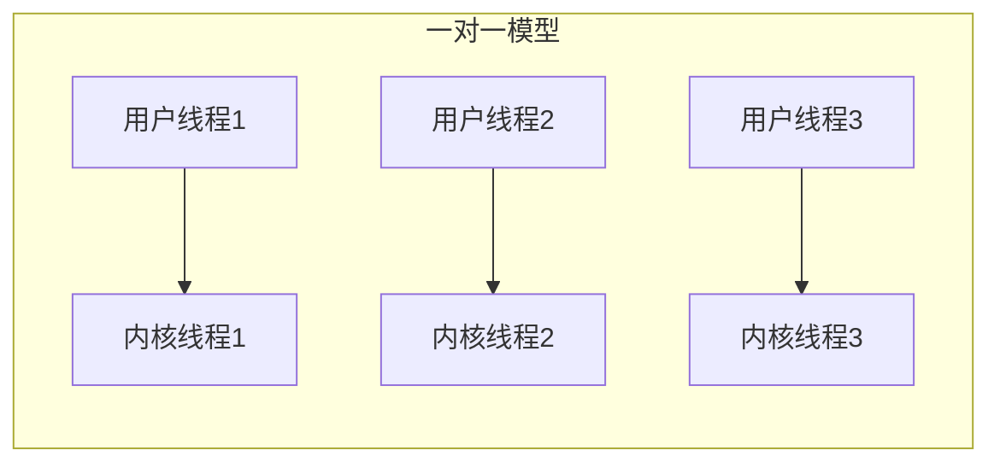
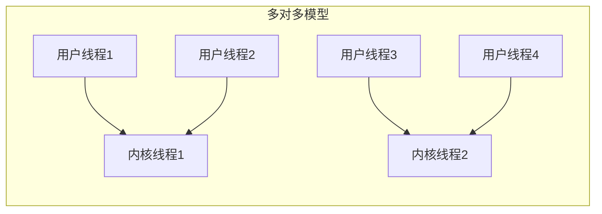

# Java 虚拟线程：新一代并发解决方案

## 前言

在高并发编程领域，`线程`一直是一个关键的概念。传统的 Java 线程是对操作系统线程的`一对一映射`
，这种实现方式虽然简单直观，但在面对现代高并发场景时却显得力不从心。每个线程都需要占用大量系统资源，且`线程切换的开销较大`
，这严重限制了应用程序的扩展性。

为了解决这个问题，一些编程语言采用了更轻量级的并发原语-`协程`。比如 `Go` 语言的 `goroutine`、`Python` 的 `asyncio`，它们都能
`以极低的资源消耗支持大规模并发`。而在 Java 世界中，随着 `JDK 21` 的发布，`虚拟线程`（Virtual Thread）终于`正式`成为 Java
平台的一部分。

虚拟线程是一种`轻量级的线程实现`，它由 `JVM` 而不是`操作系统`来调度。通过`将大量虚拟线程复用在少量操作系统线程上`，使得 JVM
也可以支持`数百万并发任务`，同时保持了传统线程编程模型的简单性。这不仅大大提升了 Java 在高并发场景下的性能，也为构建现代云原生应用提供了更好的支持。

## 一、线程的实现

在深入理解 Java 虚拟线程之前，我们需要先了解线程的基本实现方式。就以 Java 为例，当我们在 Java 中创建一个线程`Thread`时，JVM
是如何实现这个线程的。当我们调用`Thread`类的 `start`方法时，`JVM` 又是如何调度这个线程的？

从`Thread` 类的源码我们会发现，线程的很多关键方法都是用`native`修饰的，也就是通过`JNI`调用操作系统提供的 `API`
来实现的，这也就意味着，线程的实现是依赖于`操作系统`的。

```java
public class Thread implements Runnable {
    // 注册本地方法
    private static native void registerNatives();
    // 线程休眠指定纳秒数
    private static native void sleep0(long nanos) throws InterruptedException;
    // 启动线程的本地方法实现
    private native void start0();
    // 设置线程优先级
    private native void setPriority0(int newPriority);
    // 中断线程
    private native void interrupt0();
    // 清除线程中断事件
    private static native void clearInterruptEvent();
    // 设置线程名称
    private native void setNativeName(String name);
    // 让出CPU时间片
    private static native void yield0();
}
```

其实这也不难理解，现在几乎所有的主流`操作系统`都提供了`成熟的线程实现和调度机制`，直接使用操作系统的线程（也被称为`内核线程`
）不仅实现简单，而且能充分利用操作系统的线程调度和管理能力。

在 Java 中（JDK 21 之前），会为每个线程创建一个内核线程，线程的调度，上下文切换等都是由操作系统来完成的，这种`一对一`的映射方式也使得
Java 线程能够直接享受到操作系统提供的所有线程特性，如优先级调度、时间片分配等。

### 内核线程

`内核线程（Kernel Thread）`是操作系统提供的线程实现，由操作系统内核直接支持和管理。它是操作系统能够`调度的最小单位`
，也是传统操作系统实现并发的基础。

直接使用内核线程来实现线程，一个线程对应一个内核线程，也被称为 `1:1 线程模型`。
Java 中的 `Thread` 类就是使用`内核线程`来实现的。



那么，直接使用内核线程有没有什么缺点呢？

1. **创建和销毁成本高**：每创建一个内核线程都需要进行系统调用，涉及`内核态和用户态`
   的切换，同时需要分配和初始化内核数据结构。这些操作都比较耗时，会影响应用的启动速度和响应性能。

2. **内存占用大**：每个内核线程都需要独立的内核栈空间和其他内核资源。以 Java 为例，一个普通的线程通常需要约 `1MB`
   的内存空间。如果需要创建 1 万个线程，就需要消耗约 10GB 的内存，这对于资源有限的系统来说是一个巨大的负担。

3. **上下文切换开销大**：内核线程的切换需要完整保存和恢复处理器状态（包括寄存器、程序计数器等），同时涉及 TLB
   刷新和缓存失效。这种切换需要在内核态完成，开销远大于用户态的切换操作。

4. **调度开销随线程数增加而显著上升**：操作系统需要在所有线程间公平分配 CPU 时间。当线程数量增加时，调度器的负担会急剧上升，可能导致系统性能下降。

这些限制使得 Java 在云原生开发领域处于劣势，当然不光是线程的原因导致的。在云原生应用中，微服务架构要求每个服务能够
`快速启动、弹性伸缩，并高效处理大量并发请求`。但 Java 传统的线程模型存在以下问题：

1. **启动慢**：每个服务启动时都需要创建线程池，而内核线程的创建成本高，影响服务的冷启动速度。
2. **资源浪费**：为了应对流量波峰，通常需要预先创建足够的线程，这在流量低谷期会造成资源浪费。
3. **伸缩性差**：当请求量突增时，有限的线程池容量会成为性能瓶颈。
4. **响应慢**：频繁的线程上下文切换会导致较高的请求延迟。

这也是为什么在云原生时代，`Go` 语言凭借轻量级的`协程`模型获得了广泛应用。相比之下，Java 的线程模型显得过于`重量级`
，难以满足云原生应用对资源利用率和弹性伸缩的要求。

### 用户线程

除了直接使用内核线程，还有一种更轻量级的实现方式 - `用户线程`。用户线程是在`用户空间`中实现的`线程抽象`，由`编程语言运行时或虚拟机管理`
，而不是`操作系统`。它具有以下特点：

1. **轻量级**：用户线程的创建、销毁和切换都在用户态完成，不需要进行系统调用，开销很小。

2. **高度可定制**：由于是在用户空间实现，可以根据应用需求定制调度策略和管理机制。

3. **资源占用少**：每个用户线程只需要很小的内存空间来保存上下文信息。

4. **可扩展性强**：理论上可以创建的数量远超内核线程。

`Go`语言的 `goroutine` 是用户线程的典型代表。一个 `goroutine` 只占用 2-4KB 内存，而且可以`动态扩展`。`Go`
运行时会维护一个线程池，动态地将大量 `goroutine` 调度到少量操作系统线程上执行。这使得 `Go` 程序可以轻松支持数十万甚至上百万的并发
`goroutine`。

用户线程通常采用两种模型与操作系统线程映射:

- **N : 1 模型**：`多个`用户线程映射到`一个`内核线程
- **N : M 模型**：`多个`用户线程映射到`多个`内核线程

不过需要注意的是，用户线程最终也是要依赖操作系统的线程来执行。当一个用户线程执行阻塞操作时，可能会导致其他用户线程也被阻塞。因此，高效的调度和阻塞处理对用户线程的实现至关重要。



我们简单总结对比一下`内核线程`和`用户线程`：

| 特点     | 内核线程        | 用户线程          |
|--------|-------------|---------------|
| 实现层面   | 操作系统内核实现    | 用户空间实现        |
| 创建开销   | 高(需系统调用)    | 低(用户态操作)      |
| 内存占用   | 大(约 1MB/线程) | 小(约 2-4KB/线程) |
| 上下文切换  | 重量级(内核态切换)  | 轻量级(用户态切换)    |
| 调度方式   | 由操作系统调度     | 由运行时/VM 调度    |
| 可创建数量  | 受系统资源限制     | 可创建大量         |
| 阻塞影响   | 独立阻塞        | 可能影响其他线程      |
| 可定制性   | 低(依赖 OS 实现) | 高(可自定义调度)     |
| CPU 利用 | 可充分利用多核     | 依赖映射模型        |
| 实现复杂度  | 由 OS 处理     | 需要精心设计        |


## 二、虚拟线程

### 2.1 基本概念

虚拟线程（Virtual Thread）是 `JDK 19` 中`首次引入`的`预览`特性，并在 `JDK 21` 中成为`正式特性`的一种`轻量级线程实现`
，也就是上面所说的`用户线程`的一种实现，它将多个虚拟线程映射到少量`操作系统线程`(称为载体线程)
上执行。与传统的平台线程相比，虚拟线程具有以下特点:

1. **极其轻量**: 每个虚拟线程仅占用约 2KB 内存，可以创建数百万个实例。

2. **高效调度**: 由 JVM 而不是操作系统负责调度，避免了昂贵的内核态上下文切换。

3. **编程模型不变**: 使用与普通 Java 线程相同的 API，现有代码几乎不需要修改。

4. **适合 IO 密集**: 在执行 IO 操作时会自动让出载体线程，实现"异步化"。

虚拟线程的引入使得 Java 应用可以轻松实现高并发，尤其适合需要维护大量连接的网络服务。它是 Java 平台在并发编程领域的一次重要突破。

### 2.2 工作原理


虚拟线程的工作原理主要包含三个关键部分：

1. **调度机制**
   - JVM维护一个载体线程池（通常与CPU核心数相当）
   - 虚拟线程通过调度器动态分配到载体线程
   - 调度器负责虚拟线程的挂载和卸载

2. **状态管理**
   - 新建：创建虚拟线程
   - 就绪：等待被调度
   - 运行：在载体线程上执行
   - 阻塞：等待IO或同步操作
   - 终止：执行完成

3. **执行流程**
   - 挂载：获取载体线程
   - 执行：运行业务代码
   - 卸载：遇到阻塞时保存状态
   - 恢复：阻塞结束后重新调度

### 2.3 如何使用

虚拟线程的使用方式非常简单，主要有以下几种:

1. 使用 `Thread.startVirtualThread()` 直接创建和启动

```java
// 创建虚拟线程
Thread.ofVirtual().

name("virtual-thread-1").

start(() ->{
        // 虚拟线程执行的代码
        });

// 创建并启动虚拟线程
Thread vThread = Thread.startVirtualThread(() -> {
    // 虚拟线程执行的代码
});

```

2. 使用 `Executors.newVirtualThreadPerTaskExecutor()` 创建虚拟线程池，注意只有明确需要限制并发数量时才建议使用虚拟线程池。

```java
try(var executor = Executors.newVirtualThreadPerTaskExecutor()){
        executor.

submit(() ->{
        // 任务逻辑
        });
        }
```

## 三、平台线程 vs 虚拟线程：性能对比分析

可是，虚拟线程真的这么厉害吗，它真的能提升我们程序的性能吗？

下面，让我们做一个简单的性能对比测试，看看虚拟线程和平台线程（传统线程）在不同场景下的表现。

测试代码在: `https://github.com/oneinstepGO/mp-weixin-demo2` 的 `virtual-thread` 目录，感兴趣的可以自己跑一下。

### 3.1 测试场景设计

我们设计了两组关键场景：

1. **不同并发规模**（就像不同的交通流量）

   - 轻量级：100 个并发（相当于轻交通）
   - 中等负载：1000 个并发（相当于正常交通）
   - 高负载：10000 个并发（相当于拥堵时段）

2. **不同等待时间**（就像不同的路程）
   - 短等待：10ms（相当于短途运输）
   - 长等待：100ms（相当于长途运输）

### 3.2 测试结果分析

#### 1. 短等待场景（10ms）

| 并发数   | 平台线程耗时     | 虚拟线程耗时   | 性能提升   |
|-------|------------|----------|--------|
| 100   | 15.819ms   | 11.992ms | 1.32x  |
| 1000  | 125.436ms  | 13.685ms | 9.17x  |
| 10000 | 1174.503ms | 15.019ms | 78.20x |

**关键发现**：

1. **小规模场景**（100 任务）
   - 即使在轻负载下，虚拟线程也表现出约 32% 的性能优势
   - 平台线程和虚拟线程的差距相对较小

2. **中等规模**（1000 任务）
   - 负载增加时，虚拟线程的优势开始显著体现
   - 虚拟线程几乎保持稳定的性能，而平台线程耗时显著增加
   - 性能差距扩大到 9 倍以上

3. **大规模场景**（10000 任务）
   - 高并发时，虚拟线程展现出压倒性优势
   - 平台线程耗时急剧上升至 1.17 秒
   - 虚拟线程仍保持在 15ms 左右的稳定表现
   - 性能差距达到惊人的 78 倍

#### 2. 长等待场景（100ms）

| 并发数   | 平台线程耗时      | 虚拟线程耗时    | 性能提升   |
|-------|-------------|-----------|--------|
| 100   | 110.004ms   | 103.702ms | 1.06x  |
| 1000  | 1045.871ms  | 105.649ms | 9.90x  |
| 10000 | 10352.226ms | 118.488ms | 87.37x |

在长等待场景下：

1. **小规模场景**（100 任务）
   - 两种线程实现的性能差异不大
   - 虚拟线程仍略有优势

2. **中等规模**（1000 任务）
   - 平台线程性能开始显著下降，超过 1 秒
   - 虚拟线程保持稳定性能，仍在 105ms 左右
   - 性能差距接近 10 倍

3. **大规模场景**（10000 任务）
   - 平台线程性能急剧恶化，耗时超过 10 秒
   - 虚拟线程依然保持稳定，仅略微增加到 118ms
   - 性能差距达到惊人的 87 倍

**总结：** 测试结果清晰地表明，虚拟线程在各种并发规模下都优于平台线程，尤其在高并发和长等待场景下，性能优势更为显著。关键的观察点是：

1. **可扩展性**：随着并发数增加，虚拟线程的性能几乎保持线性，而平台线程则呈指数级下降。

2. **稳定性**：虚拟线程在不同负载下表现稳定，性能波动很小。

3. **等待时间影响**：当等待时间增加时，虚拟线程的优势更加明显，这证明它在 IO 密集型场景下特别有效。

## 四、实战应用

首先，我们要明白，虽然虚拟线程是 Java 在并发编程领域的一次重要突破，但是它并不是万能的，它也有自己的局限性。我们需要在合适的场景下使用它，才能充分发挥其价值。

### 4.1 虚拟线程适用场景

1. **高并发场景**

虚拟线程非常适合处理大量并发请求的场景，例如 Web 服务器。由于虚拟线程的轻量级特性，可以为每个请求分配一个虚拟线程，而不会消耗过多系统资源。

2. **IO 密集型场景**

对于需要`频繁进行 IO 操作`（如文件读写、网络通信）的应用来说，虚拟线程是理想选择。当虚拟线程在`等待 IO 时`，可以`快速切换到其他线程`
，提高资源利用率。

3. **微服务调用**

在微服务架构中，服务之间的调用通常涉及网络延迟。虚拟线程可以有效处理这种等待时间，使系统能够同时处理更多的服务请求。

4. **并发数据处理**

当需要并行处理大量数据，且每个处理任务包含 IO 操作时（如从数据库读取或写入数据），虚拟线程可以显著提升处理效率。

> 那么，虚拟线程不适合哪些场景呢？

### 4.2 虚拟线程不适用场景示例

1. **计算密集型场景**

虚拟线程主要是为了解决 IO 等待问题，对于纯计算型任务并不能带来性能提升。因为计算任务实际上是在载体线程上执行的，频繁切换反而会带来额外开销。

对于计算密集型任务，应该使用与 CPU 核心数相当的平台线程，充分利用多核处理能力。

2. **锁竞争激烈的场景**

当多个虚拟线程频繁争用同一把锁时，会导致载体线程被阻塞，失去虚拟线程的优势。因为虚拟线程的锁会阻塞载体线程，当大量虚拟线程竞争锁时，可能导致严重的性能问题。

这种场景建议:

- 减少锁的使用范围
- 使用无锁数据结构
- 或者考虑其他并发控制方式


3.**共享状态频繁访问的场景**

虚拟线程不适合频繁访问共享状态的场景。因为:

- 需要同步机制来保护共享状态，会导致锁竞争
- 虚拟线程切换频繁，增加了共享状态访问的复杂性
- 可能引发并发问题

对于这种场景，建议:

- 减少共享状态
- 使用线程安全的数据结构
- 或采用消息传递的方式代替共享状态

### 4.3 注意事项

在使用虚拟线程时，和我们平时使用的平台线程（传统线程）有些不同之处，以下是一些需要注意的地方。

**1. 避免使用线程池与虚拟线程结合**

**错误示例：**

```java
// ❌ 不推荐的做法
ExecutorService platformExecutor = Executors.newFixedThreadPool(100);
ExecutorService virtualExecutor = Executors.newVirtualThreadPerTaskExecutor();

virtualExecutor.

submit(() ->{
        // 在虚拟线程中使用平台线程池
        platformExecutor.

submit(() ->{

// 这里的任务会被阻塞在有限的平台线程池中
doSomeWork();
    });
            });
```

**正确示例：**

```java
// ✅ 推荐的做法
try(var executor = Executors.newVirtualThreadPerTaskExecutor()){
        IntStream.

range(0， 10_000).

forEach(i ->{
        executor.

submit(() ->{

doSomeWork();
            return i;
        });
                });
                }
```

**原因：**

- 线程池的设计初衷是复用线程，因为传统线程的创建和销毁开销很大，但是虚拟线程的创建和销毁开销很小，所以自然没必要进行`池化`。
- 使用线程池反而会限制并发数，限制了虚拟线程轻量级、高并发的优势。
- 可能导致线程饥饿或死锁

**2. 避免使用 ThreadLocal**

**错误示例：**

```java
// ❌ 不推荐的做法
public class ThreadLocalExample {
    private static ThreadLocal<User> userContext = new ThreadLocal<>();

    public void processUser(User user) {
        try (var executor = Executors.newVirtualThreadPerTaskExecutor()) {
            executor.submit(() -> {
                userContext.set(user);  // 在虚拟线程中使用 ThreadLocal
                doSomeWork();
                userContext.remove();
            });
        }
    }
}
```

**正确示例：**

```java
// ✅ 推荐的做法 使用ScopedValue
public class ScopedValueExample {
    // 创建一个ScopedValue实例来存储User上下文
    private static final ScopedValue<User> userContext = ScopedValue.newInstance();

    public void processUser(User user) {
        try (var executor = Executors.newVirtualThreadPerTaskExecutor()) {
            executor.submit(() -> {
                // 使用where()方法绑定值，并在run()中执行业务逻辑
                ScopedValue.where(userContext， user)
                        .run(() -> {
                           // 在这里可以通过get()方法获取上下文中的user对象
                           User currentUser = userContext.get();
                           System.out.println("Current user: " + currentUser);
                           doSomeWork();
                        });
            });
        }
    }
}
```

**原因：**

- 虚拟线程会频繁切换载体线程，ThreadLocal 的值可能会丢失或混乱，建议使用 `ScopedValue`。
- 会导致`内存泄漏`，因为虚拟线程数量可能非常大。

**3. 避免使用同步块或重量级锁**

**错误示例：**

```java
// ❌ 不推荐的做法
public class SynchronizedExample {
    private final Object lock = new Object();
    private int counter = 0;

    public void increment() {
        try (var executor = Executors.newVirtualThreadPerTaskExecutor()) {
            executor.submit(() -> {
                synchronized (lock) {  // 使用同步块会阻塞载体线程
                    counter++;
                }
            });
        }
    }
}
```

**正确示例：**

```java
// ✅ 推荐的做法
public class LockFreeExample {
    private final AtomicInteger counter = new AtomicInteger(0);

    public void increment() {
        try (var executor = Executors.newVirtualThreadPerTaskExecutor()) {
            executor.submit(() -> {
                counter.incrementAndGet();  // 使用无锁数据结构
            });
        }
    }
}
```

**原因：**

- `同步块`会导致载体线程被阻塞，降低性能。
- 可能导致其他虚拟线程无法执行
- 应该使用无锁数据结构或更轻量级的并发控制机制

**4. 避免固定虚拟线程到载体线程**

**错误示例：**

```java
// ❌ 不推荐的做法
public class PinnedExample {
    public void doWork() {
        Thread vThread = Thread.ofVirtual().start(() -> {
            // 这些操作会导致虚拟线程被固定到载体线程
            synchronized (this) {
                heavyComputation();
            }
        });
    }
}
```

**正确示例：**

```java
// ✅ 推荐的做法
public class NonPinnedExample {
    public void doWork() {
        Thread vThread = Thread.ofVirtual().start(() -> {
            // 使用非阻塞操作或轻量级同步机制
            CompletableFuture.runAsync(this::heavyComputation);
        });
    }
}
```

**原因：**

- `固定（pinning）`会导致虚拟线程失去其轻量级特性
- 会降低整体性能和可伸缩性
- 应该尽量使用非阻塞操作或异步方式

**5. 注意内存使用**

虽然单个虚拟线程很轻量（约 2KB），但创建大量虚拟线程仍然需要注意内存使用：

```java
// ❌ 可能导致内存问题的代码
public class MemoryExample {
    public void createManyThreads() {
        List<Thread> threads = new ArrayList<>();
        for (int i = 0; i < 1_000_000; i++) {
            Thread vt = Thread.ofVirtual().start(() -> {
                // 每个线程持有大量数据
                byte[] data = new byte[1024 * 1024]; // 1MB
                Thread.sleep(Duration.ofHours(1));
            });
            threads.add(vt);
        }
    }
}
```

**应该考虑**：

- 控制并发虚拟线程的数量
- 注意每个虚拟线程中的内存使用
- 及时释放不需要的资源

这些注意事项的核心是：保持虚拟线程的`轻量级`特性，`避免池化`，`避免使用会导致阻塞（例如synchronized）或固定（pinning）的操作`
，合理管理资源使用。遵循这些原则，才能充分发挥虚拟线程的优势。其实，虚拟线程的出现一部分原因也是为了让并发编程更加简单，让我们可以像编写普通代码一样编写多线程代码。

## 五、总结

总体来说，`虚拟线程`的出现不仅解决了 `Java 平台`在`高并发`场景下的`性能瓶颈`
，也为未来的应用开发提供了新的可能。它既带来了显著的性能提升，同时又保持了传统线程编程模型的简单性，是Java技术一次成功的"
创新"。

然而，虚拟线程并非万能解决方案，它更像是并发编程工具箱中的一个强大新成员。开发者需要理解它的特点和局限，在合适的场景下使用它，才能充分发挥其价值。随着实践经验的积累和生态系统的完善，虚拟线程必将在
Java 的并发编程中发挥越来越重要的作用。

---

欢迎关注我的公众号“**子安聊代码**”，一起探讨技术。
<center>
    
</center>
